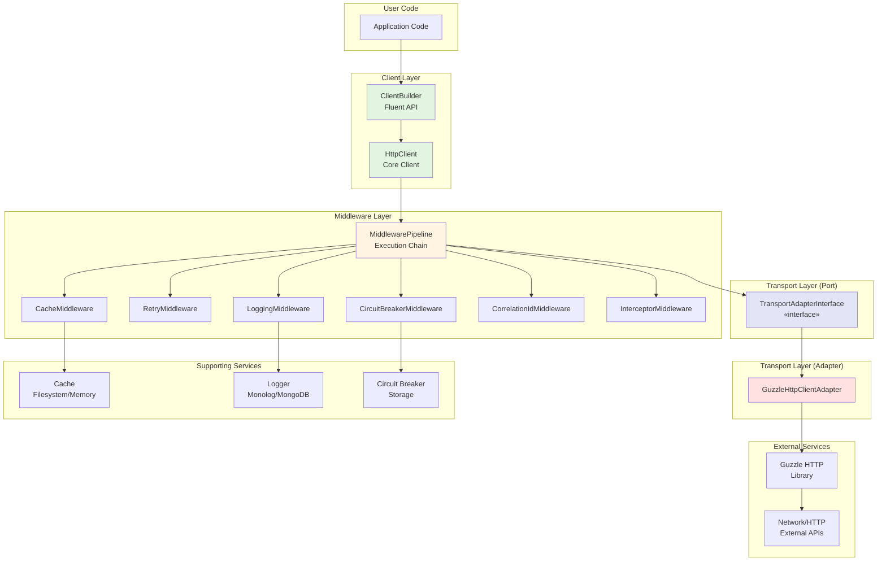
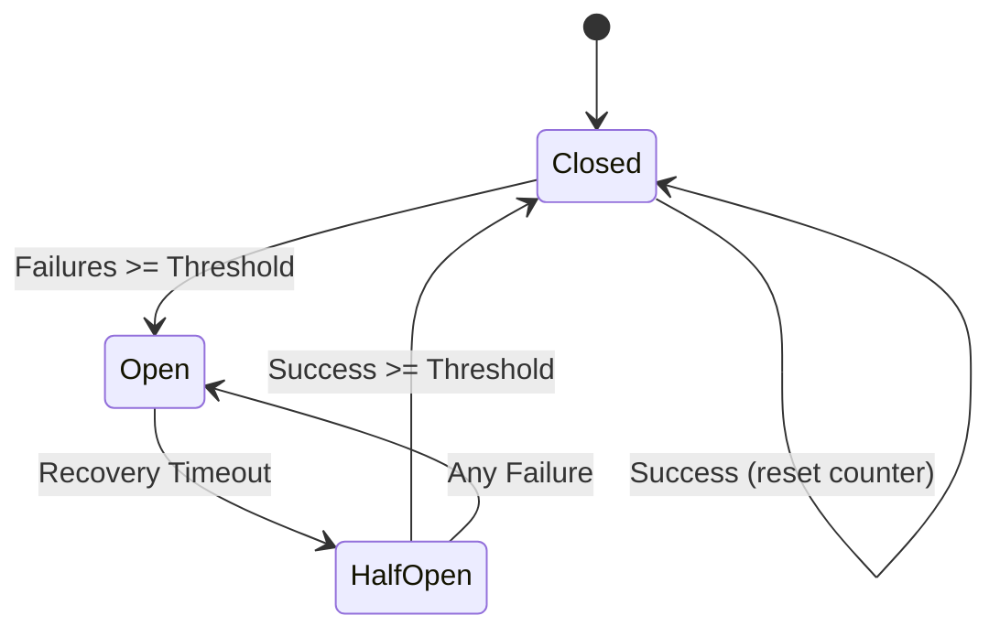
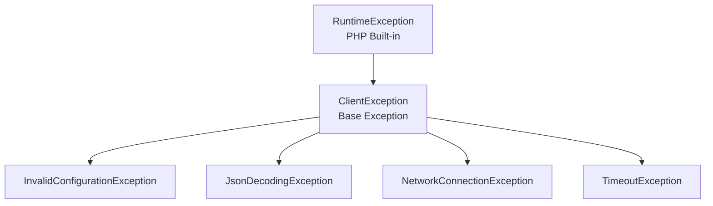
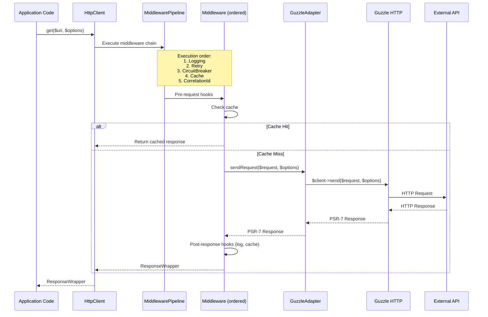
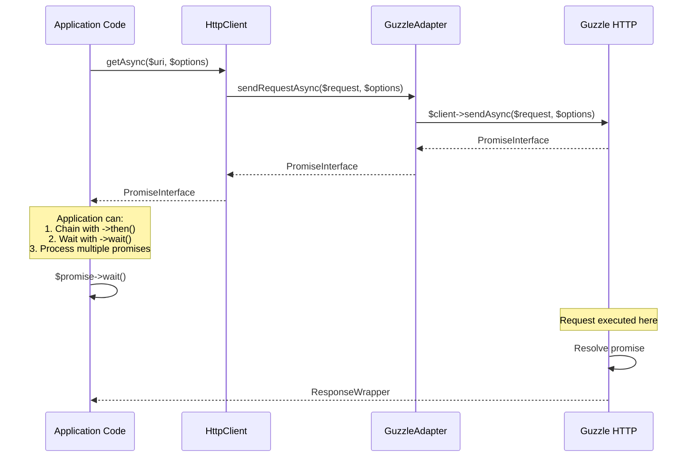
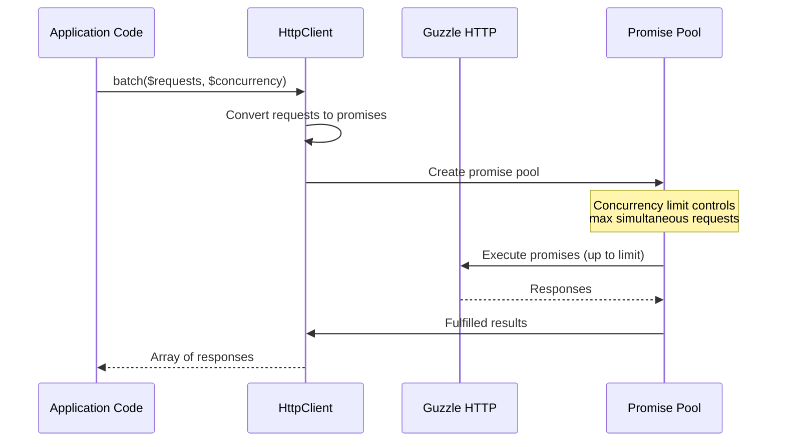
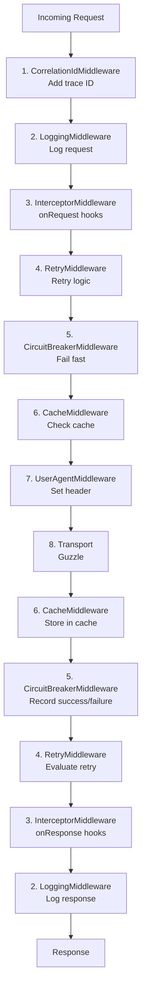

# System Architecture

## Purpose

Comprehensive technical architecture documentation with evidence-based diagrams and component descriptions.

## Audience

Software architects, senior engineers, and technical leads.

---

## Architectural Style

### Layered + Hexagonal (Ports & Adapters)

The system follows a **hybrid architectural pattern**:

1. **Layered Architecture**: Vertical organization by technical concern
2. **Hexagonal Architecture**: Horizontal isolation via interfaces

**Evidence**:
- Contracts folder contains interfaces (ports)
- Adapters folder contains implementations
- Clear dependency direction (inward toward contracts)
- README states "layered application architecture"

**Confidence**: Confirmed

---

## High-Level Architecture Diagram



**Diagram Confidence**: Confirmed (traced from source code)

---

## Component Architecture

### 1. Client Layer Components

#### ClientBuilder

**File**: `src/Client/ClientBuilder.php`

**Purpose**: Fluent API for configuring and constructing HTTP clients

**Pattern**: Builder Pattern

**Key Methods**:
```php
ClientBuilder::create(): static
->withBaseUri(string): static
->withTimeout(int): static
->withRetry(RetryConfig): static
->withCircuitBreaker(CircuitBreakerConfig): static
->withCache(CacheInterface, int): static
->withLogger(LoggerInterface, bool): static
->withCorrelationId(string): static
->onRequest(callable): static
->onResponse(callable): static
->build(): HttpClient
```

**Dependencies**:
- MiddlewarePipeline (composition)
- TransportAdapterInterface (injected)

**Testing**: `tests/Unit/Client/ClientBuilderTest.php`

**Confidence**: Confirmed

---

#### HttpClient

**File**: `src/Client/HttpClient.php`

**Purpose**: Main HTTP client implementation

**Contracts Implemented**:
- `HttpClientInterface`
- `AsyncHttpClientInterface`

**Key Methods**:
```php
get(string $uri, array $options): ResponseWrapperInterface
post(string $uri, array $options): ResponseWrapperInterface
put/patch/delete(...): ResponseWrapperInterface
getAsync(string $uri, array $options): PromiseInterface
postAsync(...): PromiseInterface
request(string $method, string $uri, array $options): ResponseWrapperInterface
requestAsync(...): PromiseInterface
batch(iterable $requests, int $concurrency): array
```

**Dependencies**:
- TransportAdapterInterface (constructor injection)

**Testing**: `tests/Unit/Client/HttpClientTest.php`, `tests/Unit/Client/HttpClientBatchTest.php`

**Confidence**: Confirmed

---

### 2. Middleware Layer Components

#### MiddlewarePipeline

**File**: `src/Middleware/MiddlewarePipeline.php`

**Purpose**: Manages middleware registration and execution order

**Key Behavior**:
- Middleware registered in order
- Executed in reverse (FIFO semantic on LIFO stack)
- Converts custom middleware to Guzzle HandlerStack format

**Methods**:
```php
add(MiddlewareInterface): void
addGuzzleMiddleware(callable $middleware, string $name): void
applyTo(HandlerStack): void
```

**Critical Logic**: Reverse iteration for proper execution order

**Testing**: `tests/Unit/Middleware/MiddlewarePipelineTest.php`

**Confidence**: Confirmed

---

#### LoggingMiddleware

**File**: `src/Middleware/LoggingMiddleware.php`

**Purpose**: Log HTTP requests and responses

**Configuration**:
- `$logger`: PSR-3 LoggerInterface
- `$logBodies`: bool (default: false)

**Logged Data**:
- Method, URI, status, duration
- Headers (redacted: authorization, cookie, token)
- Bodies (if enabled)

**Testing**: `tests/Unit/Middleware/LoggingMiddlewareTest.php`

**Confidence**: Confirmed

---

#### RetryMiddleware

**File**: `src/Middleware/RetryMiddleware.php`

**Purpose**: Retry failed requests with exponential backoff

**Configuration**: `RetryConfig` value object

**Algorithm**:
1. Check if method/status/exception is retryable
2. Calculate delay: `min(baseDelay * 2^attempt, maxDelay)`
3. Add jitter if enabled: `delay * rand(0.5, 1.5)`
4. Sleep and retry

**Retryable by Default**:
- Status codes: 429, 500, 502, 503, 504
- Methods: GET, HEAD, OPTIONS, PUT, DELETE
- Exceptions: NetworkConnectionException, TimeoutException

**Testing**: `tests/Unit/Middleware/RetryMiddlewareTest.php`, `tests/Feature/Resilience/RetryTest.php`

**Confidence**: Confirmed

---

#### CircuitBreakerMiddleware

**File**: `src/Middleware/CircuitBreakerMiddleware.php`

**Purpose**: Prevent cascading failures via circuit breaker pattern

**Configuration**: `CircuitBreakerConfig` value object

**State Machine**:



**Storage**: Pluggable via `StateStoreInterface`

**Implementations**:
- `InMemoryStateStore` (in-memory, per-process)

**Testing**: `tests/Unit/Middleware/CircuitBreakerMiddlewareTest.php`

**Confidence**: Confirmed

---

#### CacheMiddleware

**File**: `src/Middleware/CacheMiddleware.php`

**Purpose**: Cache HTTP responses (GET only)

**Configuration**:
- `$cache`: PSR-16 CacheInterface
- `$defaultTtl`: int (seconds)

**Cache Key**: Request URI

**Behavior**:
1. Check cache for existing response
2. If miss, execute request
3. Serialize ResponseWrapper to cache
4. Return cached or fresh response

**Testing**: `tests/Unit/Middleware/CacheMiddlewareTest.php`

**Confidence**: Confirmed

---

#### CorrelationIdMiddleware

**File**: `src/Middleware/CorrelationIdMiddleware.php`

**Purpose**: Add/propagate correlation IDs for distributed tracing

**Behavior**:
1. Check if correlation header exists in request options
2. If not, generate UUID v4
3. Add header to outgoing request

**Configurable**: Header name via `correlation_header` option

**Default**: `X-Correlation-ID`

**Testing**: `tests/Unit/Middleware/CorrelationIdMiddlewareTest.php`

**Confidence**: Confirmed

---

#### UserAgentMiddleware

**File**: `src/Middleware/UserAgentMiddleware.php`

**Purpose**: Set custom User-Agent header

**Configuration**: User agent string via `ClientBuilder::withUserAgent()`

**Testing**: `tests/Unit/Middleware/UserAgentMiddlewareTest.php`

**Confidence**: Confirmed

---

#### InterceptorMiddleware

**File**: `src/Middleware/InterceptorMiddleware.php`

**Purpose**: Hook into request/response lifecycle

**Hook Points**:
- `onRequest(callable)`: Modify request before sending
- `onResponse(callable)`: Process response after receiving

**Use Cases**:
- Custom authentication
- Request/response transformation
- Debugging

**Testing**: `tests/Unit/Middleware/InterceptorMiddlewareTest.php`

**Confidence**: Confirmed

---

### 3. Transport Layer (Ports & Adapters)

#### TransportAdapterInterface (Port)

**File**: `src/Contracts/TransportAdapterInterface.php`

**Purpose**: Abstract transport layer for swappable implementations

**Methods**:
```php
sendRequest(RequestInterface, array): ResponseInterface
sendRequestAsync(RequestInterface, array): PromiseInterface
createRequest(string $method, string $uri, array $options): RequestInterface
```

**Pattern**: Port (Hexagonal Architecture)

**Confidence**: Confirmed

---

#### GuzzleHttpClientAdapter (Adapter)

**File**: `src/Adapters/Guzzle/GuzzleHttpClientAdapter.php`

**Purpose**: Guzzle-specific transport implementation

**Dependencies**:
- `guzzlehttp/guzzle: ^7.9`

**Key Behavior**:
- Delegates to Guzzle Client
- Wraps Guzzle exceptions
- Manages HandlerStack for middleware

**Testing**: 
- `tests/Unit/Adapters/GuzzleHttpClientAdapterTest.php`
- `tests/Unit/Adapters/GuzzleHttpClientAdapterAsyncTest.php`

**Confidence**: Confirmed

---

### 4. Response Layer

#### ResponseWrapper

**File**: `src/Response/ResponseWrapper.php`

**Purpose**: Convenient wrapper around PSR-7 ResponseInterface

**Contract**: `ResponseWrapperInterface`

**Methods**:
```php
status(): int
json(): ?array
header(string): ?string
toDto(string $className): object
toPsrResponse(): ResponseInterface
```

**Benefits**:
- Simpler API than raw PSR-7
- JSON decoding with error handling
- DTO transformation support

**Testing**: `tests/Unit/Response/ResponseWrapperTest.php`

**Confidence**: Confirmed

---

### 5. Configuration Layer

#### ClientConfig

**File**: `src/ValueObjects/ClientConfig.php`

**Purpose**: Type-safe, immutable client configuration

**Properties** (all `public readonly`):
```php
string $baseUri
int $timeout
int $connectTimeout
array $headers
bool $verifySsl
bool $httpErrors
array $options
```

**Pattern**: Value Object

**Benefits**:
- Immutability prevents accidental mutation
- Type safety enforced by PHP
- IDE autocomplete
- PHPStan level 9 coverage

**Testing**: `tests/Unit/ValueObjects/ClientConfigTest.php`

**Confidence**: Confirmed

---

### 6. Resilience Layer

#### RetryConfig

**File**: `src/Resilience/RetryConfig.php`

**Purpose**: Type-safe retry configuration

**Properties**:
```php
int $maxAttempts = 3
int $baseDelayMs = 100
int $maxDelayMs = 2000
bool $useJitter = true
array $retryableStatuses = [429, 500, 502, 503, 504]
array $retryableMethods = ['GET', 'HEAD', 'OPTIONS', 'PUT', 'DELETE']
array $retryableExceptions = [...]
```

**Testing**: `tests/Unit/Resilience/RetryConfigTest.php`

**Confidence**: Confirmed

---

#### CircuitBreakerConfig

**File**: `src/Resilience/CircuitBreakerConfig.php`

**Purpose**: Type-safe circuit breaker configuration

**Properties**:
```php
int $failureThreshold = 5
int $recoveryTimeoutMs = 10000
int $successThreshold = 2
```

**Testing**: `tests/Unit/Resilience/CircuitBreakerConfigTest.php`

**Confidence**: Confirmed

---

### 7. Cache Layer

#### CacheInterface (Port)

**Source**: `psr/simple-cache` (PSR-16)

**Purpose**: Standard cache interface

**Methods**: `get()`, `set()`, `delete()`, `clear()`, etc.

**Confidence**: Confirmed

---

#### MemoryCache (Adapter)

**File**: `src/Cache/MemoryCache.php`

**Purpose**: In-memory PSR-16 cache implementation

**Storage**: PHP array

**Lifetime**: Request/process duration

**Testing**: `tests/Unit/Cache/MemoryCacheTest.php`

**Confidence**: Confirmed

---

#### FilesystemCache (Adapter)

**File**: `src/Cache/FilesystemCache.php`

**Purpose**: File-based PSR-16 cache implementation

**Storage**: JSON files with SHA256 hashed keys

**Security**: Fixed CVE by using JSON instead of `unserialize()`

**Testing**: `tests/Unit/Cache/FilesystemCacheTest.php`, `tests/Feature/Cache/FilesystemCacheTest.php`

**Confidence**: Confirmed

---

### 8. Logging Layer

#### LoggerInterface (Port)

**Source**: `psr/log` (PSR-3)

**Purpose**: Standard logging interface

**Confidence**: Confirmed

---

#### MonologFactory

**File**: `src/Logging/MonologFactory.php`

**Purpose**: Create pre-configured Monolog loggers

**Methods**:
```php
static createDaily(string $domain, ?string $path): Logger
```

**Testing**: `tests/Feature/Logging/PhysicalLoggingTest.php`

**Confidence**: Confirmed

---

#### MongoDbLogger

**File**: `src/Logging/MongoDbLogger.php`

**Purpose**: PSR-3 logger writing to MongoDB

**Storage**: `ClientRequestLog` Eloquent model

**Configuration**:
- Connection name
- Collection name
- Body truncation limits
- Header redaction rules

**Testing**: `tests/Unit/Logging/MongoDbLoggerTest.php`, `tests/Feature/Logging/MongoDbLoggingTest.php`

**Confidence**: Confirmed

**Question**: Why MongoDB for generic library?

---

### 9. Exception Layer

**Directory**: `src/Exceptions/`

**Exception Hierarchy**:



**Testing**: Exception tests in respective unit tests

**Confidence**: Confirmed

---

### 10. Support Layer

#### OptionsMerger

**File**: `src/Support/OptionsMerger.php`

**Purpose**: Merge base options with request-specific options

**Key Behavior**:
- Deep merges headers array
- Shallow merges other options (Guzzle format)
- Request options override base options

**Method**:
```php
public function merge(array $baseOptions, array $requestOptions): array
```

**Usage**: Used internally by `HttpClient` to combine client-level config with per-request options

**Example**:
```php
// Base: ['headers' => ['Accept' => 'application/json'], 'timeout' => 10]
// Request: ['headers' => ['Authorization' => 'Bearer token'], 'timeout' => 5]
// Result: ['headers' => ['Accept' => 'application/json', 'Authorization' => 'Bearer token'], 'timeout' => 5]
```

**Testing**: `tests/Unit/Support/OptionsMergerTest.php`

**Confidence**: Confirmed

---

## Request Lifecycle

### Synchronous Request Flow



**Evidence**: Traced through `HttpClient::request()` → `MiddlewarePipeline::applyTo()` → middleware handlers

**Confidence**: Confirmed

---

### Async Request Flow



**Evidence**: `HttpClient::requestAsync()` implementation

**Confidence**: Confirmed

---

### Batch Processing Flow



**Evidence**: `HttpClient::batch()` implementation using Guzzle Pool

**Confidence**: Confirmed

---

## Middleware Execution Order

### Registration Order vs Execution Order

**Critical Concept**: Middleware registered first executes **outermost**.

**Example**:
```php
$builder = ClientBuilder::create()
    ->withLogger($logger)        // 1. Registered first
    ->withRetry($retryConfig)    // 2. Registered second
    ->withCache($cache);         // 3. Registered third
```

**Execution Order**:
1. **Request flow**: Logger → Retry → Cache → Transport
2. **Response flow**: Cache → Retry → Logger

**Why?** Guzzle uses LIFO stack, `MiddlewarePipeline` reverses registration order to create FIFO semantic.

**Evidence**: `MiddlewarePipeline::applyTo()` reverse iteration, comments in ClientBuilder

**Confidence**: Confirmed

---

### Recommended Middleware Order



**Evidence**: Comments in `ClientBuilder.php` lines 186-191

**Confidence**: Confirmed

---

## Cross-Cutting Concerns

### Error Handling Strategy

**Layers**:
1. **Transport Layer**: Catch Guzzle exceptions, wrap in custom exceptions
2. **Middleware Layer**: Catch transport exceptions, apply resilience logic
3. **Client Layer**: Propagate exceptions or return error responses

**Exception Wrapping**:
```
Guzzle ConnectException → NetworkConnectionException
Guzzle RequestException → retain or wrap
Guzzle ClientException (4xx) → propagated
Guzzle ServerException (5xx) → propagated or retried
```

**Evidence**: `GuzzleHttpClientAdapter` exception handling

**Confidence**: Confirmed

---

### Configuration Management

**Pattern**: Immutable Value Objects

**Benefits**:
- Type safety
- No accidental mutation
- Clear ownership
- Easy testing

**Example Classes**:
- `ClientConfig`
- `RetryConfig`
- `CircuitBreakerConfig`

**Confidence**: Confirmed

---

### Dependency Injection

**Strategy**: Constructor injection of interfaces

**Example**:
```php
class HttpClient {
    public function __construct(
        private readonly TransportAdapterInterface $adapter
    ) {}
}
```

**Benefits**:
- Testability (mock adapters)
- Flexibility (swap implementations)
- Dependency inversion principle (SOLID)

**Confidence**: Confirmed

---

## Testing Architecture

### Test Structure

```
tests/
├── Unit/           # Isolated component tests (mocked dependencies)
├── Feature/        # Feature tests (real objects, minimal mocking)
├── Integration/    # Integration tests
├── Arch/           # Architecture tests
└── Benchmark/      # Performance tests (PHPBench)
```

**Evidence**: Directory structure, `phpunit.xml` configuration

**Confidence**: Confirmed

---

### Test Doubles

**Mocking Strategy**:
- Mock external dependencies (Guzzle, PSR interfaces)
- Real objects for internal components
- Spy pattern for verifying calls

**Evidence**: Test files use Mockery, PHPUnit mocks

**Confidence**: Confirmed

---

## Security Architecture

### Input Validation

**Where**: Minimal validation (library, not application)

**Validations**:
- URLs validated by Guzzle
- Options validated by type hints
- JSON validated by decoder

**Evidence**: Type hints throughout codebase

**Confidence**: Confirmed

---

### Sensitive Data Handling

**Strategy**: Redaction in logs

**Redacted Headers**:
- `authorization`
- `cookie`
- `set-cookie`
- `token`

**Evidence**: `LoggingMiddleware` redaction logic, `MongoDbLogger` configuration

**Confidence**: Confirmed

---

### Deserialization Security

**Fixed Vulnerability**: CVE-2026-XXXX (documented in `FilesystemCache`)

**Issue**: Old code used `unserialize()` which allows arbitrary code execution

**Fix**: Switched to JSON encoding/decoding

**Evidence**: `FilesystemCache` code comments

**Confidence**: Confirmed

---

## Performance Considerations

### Caching Strategy

**Cache Layers**:
1. **Memory Cache**: Fastest, per-request lifetime
2. **Filesystem Cache**: Slower, persistent across requests

**Recommendation**: Use MemoryCache for same-request deduplication, FilesystemCache for cross-request caching

**Evidence**: Two cache implementations

**Confidence**: Recommendation

---

### Async Performance

**Concurrency**: Configurable in `batch()` method (default: 25)

**Trade-offs**:
- Higher concurrency = faster total time, more memory
- Lower concurrency = slower, less memory

**Evidence**: `HttpClient::batch()` implementation

**Confidence**: Confirmed

---

## Scalability

### Horizontal Scaling

**Circuit Breaker State**: Must be shared across instances

**Solutions**:
- Implement custom `StateStoreInterface` using Redis or database
- Default `InMemoryStateStore` is per-process only

**Evidence**: `StateStoreInterface` allows pluggable storage, but only in-memory implementation exists

**Confidence**: Confirmed (interface), Recommendation (Redis implementation needed)

---

### Vertical Scaling

**Memory**: Async batch processing accumulates responses in memory

**Limitation**: Batch size × response size must fit in PHP memory

**Mitigation**: Use streaming or chunking for large batches

**Evidence**: `batch()` waits for all promises before returning

**Confidence**: Risk (Low) - typical for promise-based systems

---

## Extensibility Points

### 1. Custom Middleware

**Interface**: `MiddlewareInterface`

**Implementation**:
```php
class CustomMiddleware implements MiddlewareInterface {
    public function __invoke(callable $handler): callable {
        return function ($request, $options) use ($handler) {
            // Pre-request logic
            $promise = $handler($request, $options);
            // Post-response logic
            return $promise;
        };
    }
}
```

**Registration**: `ClientBuilder::addMiddleware($middleware, $priority)`

**Evidence**: `MiddlewareInterface` contract

**Confidence**: Confirmed

---

### 2. Custom Transport Adapter

**Interface**: `TransportAdapterInterface`

**Use Cases**:
- Symfony HTTP Client adapter
- cURL adapter
- Mock adapter for testing

**Evidence**: Existing `GuzzleHttpClientAdapter` implementation

**Confidence**: Confirmed

---

### 3. Custom Cache Storage

**Interface**: `Psr\SimpleCache\CacheInterface` (PSR-16)

**Use Cases**:
- Redis cache
- Memcached
- Database cache

**Evidence**: PSR-16 interface usage

**Confidence**: Confirmed

---

### 4. Custom Logger

**Interface**: `Psr\Log\LoggerInterface` (PSR-3)

**Use Cases**:
- Syslog
- Elasticsearch
- CloudWatch

**Evidence**: PSR-3 interface usage

**Confidence**: Confirmed

---

### 5. Custom Circuit Breaker Storage

**Interface**: `StateStoreInterface`

**Use Cases**:
- Redis storage (would need implementation)
- Shared database (would need implementation)
- Distributed cache (would need implementation)

**Evidence**: Existing `InMemoryStateStore` implementation, `StateStoreInterface` contract

**Confidence**: Confirmed (interface exists, only in-memory implementation currently)

---

## Architectural Decisions

### ADR 1: Why Guzzle Dependency?

**Decision**: Use Guzzle as transport layer

**Rationale** (Inferred):
- Battle-tested HTTP client
- Rich middleware ecosystem
- PSR-7/PSR-18 compliant
- Async support via promises

**Trade-offs**:
- Couples to Guzzle versioning
- Adds dependency weight

**Confidence**: Inferred

---

### ADR 2: Why Builder Pattern?

**Decision**: Fluent builder for client configuration

**Rationale** (Inferred):
- Improves discoverability (IDE autocomplete)
- Reduces boilerplate
- Enforces configuration before client creation
- Modern PHP API design

**Confidence**: Inferred

---

### ADR 3: Why Middleware Pipeline?

**Decision**: Composable middleware architecture

**Rationale** (Inferred)**:
- Separation of concerns (each middleware = single responsibility)
- Extensibility (add custom middleware)
- Reusability (middleware independent of client)
- Testability (test middleware in isolation)

**Confidence**: Inferred from architecture

---

### ADR 4: Why Value Objects for Config?

**Decision**: Immutable readonly value objects

**Rationale** (Confirmed):
- Type safety via PHP 8.2+ readonly properties
- Immutability prevents bugs
- PHPStan level 9 compliance
- Clear data contracts

**Evidence**: Comments in code, PHP 8.2+ requirement

**Confidence**: Confirmed

---

### ADR 5: Why PSR Interfaces?

**Decision**: Depend on PSR-3 (logging), PSR-7 (HTTP messages), PSR-16 (caching)

**Rationale** (Inferred):
- Interoperability with ecosystem
- Dependency inversion
- Flexibility (swap implementations)
- Industry standards

**Confidence**: Confirmed

---

## Architecture Quality Metrics

### Static Analysis: PHPStan Level 9

**What it enforces**:
- Strict types
- No mixed types
- No implicit returns
- No missing types
- Dead code detection

**Evidence**: `phpstan.neon` configuration, `composer stan` passing

**Confidence**: Confirmed

---

### Test Coverage: 100% (Claimed)

**Evidence**: README badge states 100% coverage

**Unknown**: Actual coverage percentage (no report file found)

**Confidence**: Inferred from README

---

### Cyclomatic Complexity

**Unknown**: No complexity metrics found

**Recommendation**: Add `phpmd` complexity checks

**Confidence**: Gap identified

---

## Related Documents

- [Project Overview](../00-architecture/01-project-overview.md)
- [Feature Inventory](../00-architecture/04-modules-and-domains.md)
- [Business Context and Goals](business-context-and-goals.md)
- [Runtime and Dependencies](03-tech-stack.md)
- [Testing Strategy](../04-development/testing.md)
