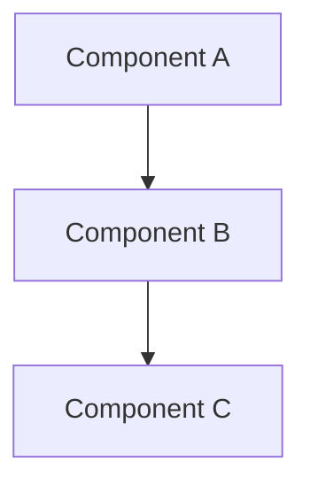
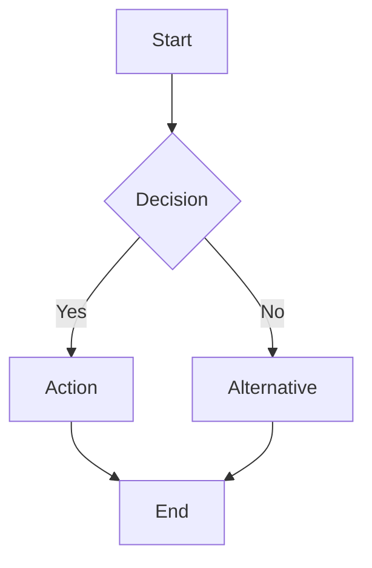
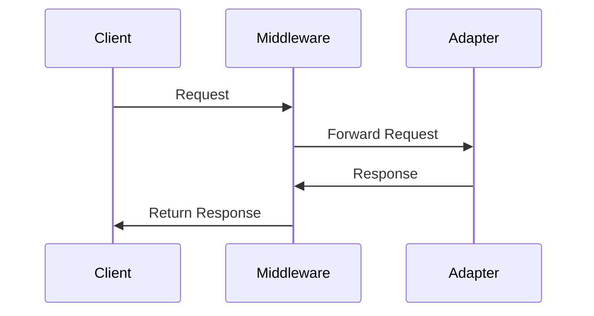
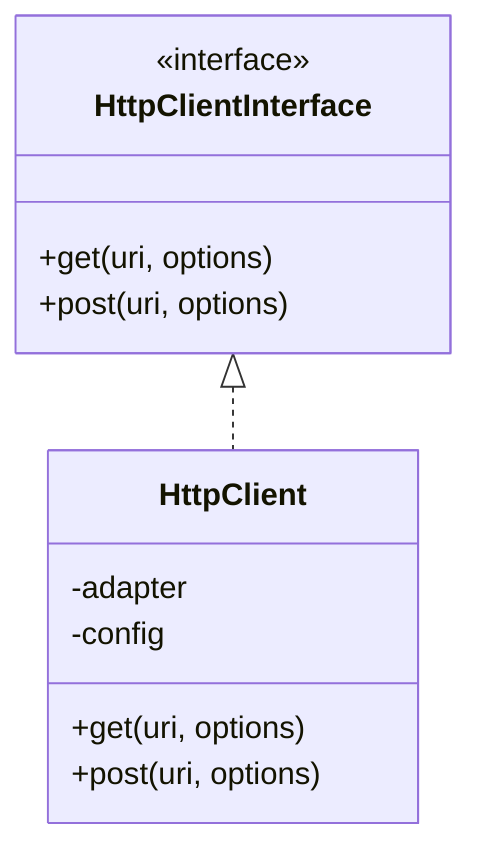

# Templates and Writing Rules

## Purpose

Provides templates and specific writing guidance for contributors creating or updating documentation.

## Audience

Documentation contributors and maintainers.

---

## Standard Document Template

Use this template for technical documentation:

```markdown
# [Document Title]

## Purpose
[What this document covers and why it exists]

## Audience
[Who should read this: developers, operators, business stakeholders, etc.]

## Summary
[2-3 sentence overview]

---

## [Main Section 1]

### Context

### Implementation

**Evidence**: [File references]

### Diagram

```mermaid
[If applicable]
```

### Operational Notes

[If applicable]

---

## Risks and Caveats

[Known issues, limitations, or concerns]

---

## Related Documents

- [Link to related doc](path/to/doc.md)
```

---

## Section-Specific Templates

### Architecture Document Template

```markdown
# [Component/System Name] Architecture

## Purpose
Explain the architecture of [X].

## Audience
Architects, senior developers, maintainers.

## Architectural Style

**Confirmed**: [What is directly visible]

**Inferred**: [What can be concluded]

**Unknown**: [What cannot be determined]

## Components

| Component | Responsibility | Location | Dependencies |
|-----------|---------------|----------|--------------|
| | | | |

## Dependency Flow



## Key Design Decisions

1. **Decision**: [What]
   - **Rationale**: [Why - if evident]
   - **Evidence**: [Source reference]

## Coupling and Boundaries

[Analysis of coupling, cohesion, boundaries]

## Risks

[Architectural risks or concerns]

## Related Documents

- [Link]
```

### Setup/Operations Document Template

```markdown
# [Setup/Operation Name]

## Purpose
How to [perform operation].

## Audience
[Developers, DevOps, etc.]

## Prerequisites

- [Requirement 1]
- [Requirement 2]

## Steps

### 1. [Step Name]

```bash
# Commands
```

**Expected outcome**: [What should happen]

### 2. [Next Step]

...

## Verification

How to verify success:

```bash
# Verification commands
```

## Troubleshooting

| Problem | Cause | Solution |
|---------|-------|----------|
| | | |

## Related Documents

- [Link]
```

### API/Interface Document Template

```markdown
# [Interface Name] Reference

## Purpose
Document the [X] interface/API.

## Audience
Library users, developers.

## Interface Definition

**Location**: `path/to/interface.php`

```php
interface [Name] {
    // Interface signature
}
```

## Methods

### [methodName]

**Signature**: `public function methodName($param): ReturnType`

**Purpose**: [What it does]

**Parameters**:
- `$param` (Type): Description

**Returns**: Description

**Example**:

```php
// Usage example
```

**Exceptions**: [If applicable]

## Implementation Notes

[Important details]

## Related Documents

- [Link]
```

### Risk/Audit Document Template

```markdown
# [Risk Category] Review

## Purpose
Identify and document [security/performance/quality] risks.

## Scope
[What was reviewed]

## Findings

| ID | Area | Finding | Evidence | Severity | Confidence |
|----|------|---------|----------|----------|-----------|
| R1 | | | | High/Med/Low | Confirmed/Inferred |

## Detailed Analysis

### [Risk ID]: [Short Title]

**Evidence**: [Source references]

**Impact**: [What could happen]

**Likelihood**: [Assessment]

**Recommendation**: [How to address]

## Related Documents

- [Link]
```

---

## Writing Style Rules

### 1. Be Specific

❌ "The system is scalable and performant."

✅ "The batch processing supports configurable concurrency (default 25) via `HttpClient::batch()`."

### 2. Use Active Voice

❌ "Requests are processed by the middleware pipeline."

✅ "The middleware pipeline processes requests in FIFO order."

### 3. Provide Evidence

❌ "The library uses caching for performance."

✅ "The library provides PSR-16 caching via `CacheMiddleware` (`src/Middleware/CacheMiddleware.php`), with `MemoryCache` and `FilesystemCache` implementations."

### 4. Be Honest About Uncertainty

❌ "The circuit breaker handles all failure scenarios."

✅ **Known**: Circuit breaker opens after threshold failures. **Unknown**: Behavior with mixed failure types (timeouts vs HTTP errors) requires testing to verify.

### 5. Use Tables for Structured Data

Prefer tables over long prose for:
- Feature inventories
- Component lists
- Configuration options
- API parameters
- Comparisons

Example:

| Middleware | Purpose | Configurable | Evidence |
|------------|---------|--------------|----------|
| RetryMiddleware | Retry failed requests | Yes | `src/Middleware/RetryMiddleware.php` |
| CacheMiddleware | Cache responses | Yes | `src/Middleware/CacheMiddleware.php` |

### 6. Use Code Examples Sparingly

Include code examples when they:
- Demonstrate actual usage
- Clarify complex concepts
- Show configuration options
- Provide quick reference

Extract examples from actual working code (tests or docs/user/examples/) when possible.

---

## Diagram Guidelines

### When to Use Diagrams

Use diagrams when they:
- Clarify relationships better than prose
- Show flow/sequence
- Illustrate architecture
- Demonstrate state changes

### Mermaid Syntax Examples

#### Flowchart



#### Sequence Diagram



#### Class Diagram



### Diagram Best Practices

1. Keep diagrams simple and focused
2. Label relationships clearly  
3. Use consistent naming with code
4. Include legend if needed
5. Reference diagram in surrounding text
6. Don't diagram fantasy architecture

---

## Cross-Referencing

### Linking to Other Docs

Use relative paths:

```markdown
See [System Architecture](../03-architecture/system-architecture.md) for details.
```

### Linking to Code

Reference specific files:

```markdown
The implementation is in `src/Client/ClientBuilder.php`.
```

Or with line numbers (when stable):

```markdown
See `src/Client/ClientBuilder.php` lines 184-189.
```

### Linking to External Resources

Include context:

```markdown
Uses [Guzzle 7](https://docs.guzzlephp.org/en/stable/) as the HTTP transport layer.
```

---

## Review Checklist

Before submitting documentation:

- [ ] Evidence supports all claims
- [ ] File paths verified
- [ ] Diagrams match code
- [ ] Examples tested
- [ ] Cross-references valid
- [ ] Confidence levels marked
- [ ] No empty corporate language
- [ ] Tables used for structured data
- [ ] Active voice used
- [ ] Spelling and grammar checked
- [ ] Related documents linked

---

## Related Documents

- [Documentation Standards](documentation-standards.md)
- [Confidence Levels](confidence-levels.md)
- [Glossary](glossary.md)
