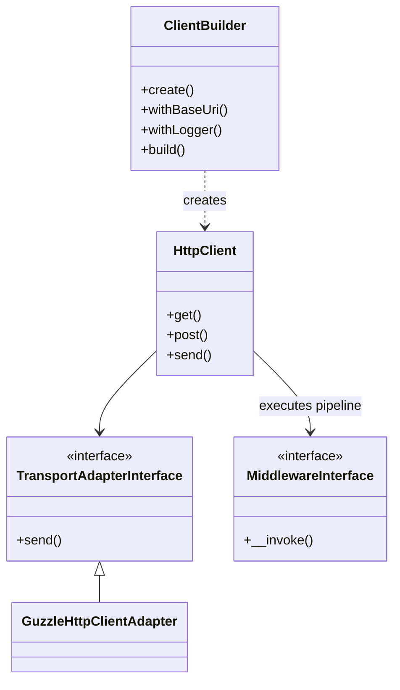

# JOOClient Architecture Documentation

## Overview
JOOClient is a Laravel 12 package that provides an enhanced Guzzle HTTP client wrapper with pluggable logging, retry logic, caching, and middleware support.

## Requirements
- **PHP**: 8.4+
- **Laravel**: 12.x
- **Database**: MySQL 8.0+ or MongoDB 6.0+

---

## Architecture Layers

### 1. Entry Point Layer
- **ClientBuilder**: Fluent, immutable builder for creating configured clients.
- **JooclientServiceProvider**: Laravel service provider.

### 2. Client Layer
- **HttpClient**: The main client wrapper.
- **TransportAdapterInterface**: Abstraction for the underlying HTTP sender (default: Guzzle).

### 3. Logging Layer
- **PSR-3 Integration**: Uses standard `Psr\Log\LoggerInterface`.
- **LoggingMiddleware**: Captures traffic and writes to the injected logger.
- **MonologFactory**: Helper to create simple Monolog instances.

#### Core Loggers
- **DbLogger**: Writes to MySQL via Laravel's DB facade
- **MongoDbLogger**: Writes to MongoDB collections
- Implements PSR-3 LoggerInterface

#### Configuration (Value Objects)
- **DatabaseConnectionConfig**: MySQL connection config
- **MongoDbConfig**: MongoDB connection config
- **RetriesConfig**: Retry behavior config

#### Supporting Components
- **LogBuffer**: Instance-based buffer for batch writes
- **RequestResponseExtractor**: Extracts HTTP data for logging
- **RequestBodyHandler**: Handles request body buffering
- **ErrorHandlerTrait**: Shared error handling logic

### 4. Middleware Layer
- **MonologLoggingMiddlewareFactory**: Creates Monolog middleware
- **DbLoggingMiddlewareFactory**: Creates DB/MongoDB logging middleware
- **RequestResponseLogger**: Logs requests/responses

### 5. Support Layer
- **ConfigParser**: Parses array config to typed objects
- **DatabaseHelper**: Laravel DB facade with Capsule fallback
- **LoggingConstants**: All magic strings/numbers

### 6. Repository Layer
- **ClientRequestLogRepository**: Persists logs with fallback strategy

### 7. Model Layer
- **ClientRequestLog**: Eloquent model for querying logs

---

## Design Patterns Used

### 1. Factory Pattern
**Classes**: `Factory`, `*MiddlewareFactory`

**Purpose**: Create complex objects with fluent API
```php
$factory = (new Factory())
    ->addOptions(['timeout' => 30])
    ->enableRetries(3, 1, 500)
    ->enableDbLogging('127.0.0.1', 3306, 'mydb');
```

### 2. Strategy Pattern
**Classes**: `LoggingAdapterInterface`, `*LoggingAdapter`

**Purpose**: Pluggable logging backends (MySQL, MongoDB, Monolog)
```php
interface LoggingAdapterInterface {
    public function log($level, $message, array $context): void;
    public function flush(): void;
}
```

### 3. Adapter Pattern
**Classes**: `DbLoggingAdapter`, `MongoDbLoggingAdapter`, `MonologLoggingAdapter`

**Purpose**: Adapt different loggers to common interface

### 4. Value Object Pattern
**Classes**: `DatabaseConnectionConfig`, `MongoDbConfig`, `RetriesConfig`

**Purpose**: Immutable configuration objects with validation

### 5. Repository Pattern
**Classes**: `ClientRequestLogRepository`

**Purpose**: Abstract data persistence logic

### 6. Builder Pattern
**Classes**: `Factory` (immutable builder)

**Purpose**: Fluent configuration API with immutability

---

## SOLID Principles Adherence

### Single Responsibility Principle ✅
Each class has ONE reason to change:
- `DbLogger`: MySQL logging only
- `MongoDbLogger`: MongoDB logging only
- `LogBuffer`: Buffer management only
- `RequestResponseExtractor`: Data extraction only
- `DatabaseHelper`: Database connection abstraction only

### Open/Closed Principle ✅
- Open for extension via interfaces
- Closed for modification (use composition)
- Example: Add custom extractor by implementing `RequestResponseExtractorInterface`

### Liskov Substitution Principle ✅
- All adapters are interchangeable via `LoggingAdapterInterface`
- All extractors are interchangeable via `RequestResponseExtractorInterface`

### Interface Segregation Principle ✅
- `LoggingAdapterInterface`: Only 3 methods (log, flush, getPsrLogger)
- `RequestResponseExtractorInterface`: Only 2 methods (extract request/response)
- No fat interfaces

### Dependency Inversion Principle ✅
- Depend on abstractions (interfaces), not concretions
- `DbLogger` depends on `RequestResponseExtractorInterface`, not concrete class
- Injected via constructor

---

## Data Flow

### 1. Request Lifecycle
```mermaid
flowchart TD
    User[User Code] --> Builder[ClientBuilder::build()]
    Builder --> Client[HttpClient]
    Client --> CustomMiddleware[Middleware Pipeline]
    
    subgraph Pipeline
        UserAgent[UserAgent Middleware] --> Correlation[CorrelationID Middleware]
        Correlation --> Logging[Logging Middleware]
        Logging --> Cache[Cache Middleware]
        Cache --> Retry[Retry Middleware]
        Retry --> CircuitBreaker[Circuit Breaker]
    end
    
    CustomMiddleware --> Pipeline
    CircuitBreaker --> Adapter[Transport Adapter (Guzzle)]
    Adapter --> Internet((Internet))
    
    Internet --> Response
    Response --> Logging
    Logging --> Logger[PSR-3 Logger]
```

### 2. Configuration Flow
```
config/jooclient.php (Laravel config)
  ↓
Jooclient::fromConfig()
  ↓
ConfigParser::parse*Config()
  ↓
Value Objects (DatabaseConnectionConfig, etc.)
  ↓
Factory methods (enableDbLogging, etc.)
  ↓
Configured Factory
```

---

## Key Components Explained

### LogBuffer
**Purpose**: Batch log entries to reduce database writes

**Features**:
- Size limit (1000 entries)
- Memory leak prevention (always clears)
- Groups entries by table/collection

**When to use**: High-traffic applications

### RequestResponseExtractor
**Purpose**: Extract HTTP request/response data for logging

**Features**:
- Type-safe extraction
- Body size limiting
- Header sanitization
- Circular reference handling

**Why separate class**: Single Responsibility - extraction logic isolated

### DatabaseHelper
**Purpose**: Abstract database connection (Laravel DB facade vs Capsule)

**Why needed**:
- Laravel production: uses DB facade
- Tests: uses Capsule Manager
- Single point of control

### ErrorHandlerTrait
**Purpose**: Share error handling logic across middleware factories

**Benefits**:
- DRY (Don't Repeat Yourself)
- Consistent error handling
- Enhanced error context (traces, file, line)

---

## Performance Optimizations

### 1. Schema Check Caching
`ClientRequestLogRepository` caches column list to avoid repeated schema queries.

### 2. Batch Processing
LogBuffer groups entries and inserts in chunks (500 per batch).

### 3. Connection Pooling
Laravel's DB connection pooling is used (no separate connections).

### 4. Lazy Initialization
MongoDB connection only created when first log is written.

### 5. Circular Reference Detection
Prevents infinite loops during context serialization.

---

## Error Handling Strategy

### Three Fallback Options:
1. **'error_log'** (default): Log to PHP error_log
2. **'throw'**: Throw exception (fails fast)
3. **'silent'**: Suppress errors (use cautiously)

### Retry Logic:
- Exponential backoff (100ms * attempt)
- Retryable errors detected by code/message
- Max 3 attempts per batch

### Failure Logging:
All failures logged to: `/tmp/jooclient_{driver}_logger_failures.log`

---

## Testing Strategy

### Test Categories:
1. **Unit Tests**: Individual class behavior
2. **Integration Tests**: Database/MongoDB integration
3. **Middleware Tests**: Request/response flow
4. **Exception Tests**: Error handling paths

### Test Doubles:
- Mock responses via `Factory::fakeResponses()`
- History tracking for assertions
- Anonymous loggers for verification

---

## Extension Points

### 1. Custom Extractor
```php
class MyCustomExtractor implements RequestResponseExtractorInterface {
    public function extractRequestData($request, array $row): array {
        // Custom logic
    }
}

// Register in Laravel
$this->app->bind(RequestResponseExtractorInterface::class, MyCustomExtractor::class);
```

### 2. Custom Logging Adapter
```php
class ElasticsearchAdapter implements LoggingAdapterInterface {
    // Implement interface
}
```

### 3. Custom Middleware
```php
$factory = $factory->addMiddleware($myMiddleware, 'my_middleware');
```

---

## Laravel Integration

### Service Container Bindings:
- `'jooclient'` → Configured Factory instance
- `Factory::class` → Alias to 'jooclient'
- `RequestResponseExtractorInterface::class` → RequestResponseExtractor

### Dependency Injection:
```php
class MyController {
    public function __construct(
        private Factory $jooclient
    ) {}

    public function makeRequest() {
        $result = $this->jooclient->make();
        $response = $result->get('/api/endpoint');
    }
}
```

### Configuration Publishing:
```bash
php artisan vendor:publish --provider="JOOservices\Client\Providers\JooclientServiceProvider"
```

---

## Best Practices

### 1. Always Flush Batched Logs
```php
$result = $factory->make();
// ... make requests ...
$result->flushLogger(); // Important!
```

### 2. Use Appropriate Driver
- **MySQL**: Relational queries needed
- **MongoDB**: Flexible schema, high write volume
- **Monolog**: File-based, development

### 3. Configure Timeouts
```php
$factory = $factory->addOptions(['timeout' => 30, 'connect_timeout' => 5]);
```

### 4. Handle Exceptions
```php
try {
    $response = $result->get('/api/endpoint');
} catch (\GuzzleHttp\Exception\RequestException $e) {
    // Logged automatically if logging enabled
    Log::error('API request failed', ['exception' => $e->getMessage()]);
}
```

---

## Security Considerations

1. **Credentials**: Never commit database credentials
2. **Body Logging**: May contain sensitive data - use with caution
3. **Context Sanitization**: Circular references and objects are sanitized
4. **Size Limits**: Bodies truncated to prevent DoS

---

## Maintenance

### Adding a New Logging Driver:
1. Create Logger class implementing `LoggerInterface`
2. Create Adapter implementing `LoggingAdapterInterface`
3. Create Config value object
4. Update `ConfigParser`
5. Update `Jooclient::applyLogging()`
6. Add constant to `LoggingConstants`
7. Write tests

### Performance Monitoring:
- Check `/tmp/jooclient_*_logger_failures.log` for issues
- Monitor buffer sizes in high-traffic scenarios
- Use batch mode for >100 requests/second

---

## Class Dependency Graph



---

## File Organization

```
src/
├── Config/              # Configuration parsing
├── Constants/           # Application constants
├── Contracts/           # Interfaces
├── Factory/             # Factory and result objects
├── Logging/             # All logging components
│   ├── Buffers/        # Buffer management
│   ├── Config/         # Logging configuration VOs
│   ├── Contracts/      # Logging interfaces
│   ├── Drivers/        # Adapter implementations
│   ├── Extractors/     # Data extraction logic
│   ├── Handlers/       # Request handling
│   └── Middlewares/    # Middleware factories
├── Middlewares/         # Guzzle middlewares
├── Models/              # Eloquent models
├── Providers/           # Laravel service providers
├── Repositories/        # Data persistence
└── Support/             # Helper utilities
```

---

## Changelog

### Version 1.0.0
- Initial release
- MySQL logging support
- Monolog logging support
- **MongoDB logging support ⭐**
- Laravel 12 compatibility
- PHP 8.5 compatibility
- Comprehensive test suite (14 tests, 59 assertions)
- Full SOLID compliance
- Performance optimizations (caching, batching, retry logic)


