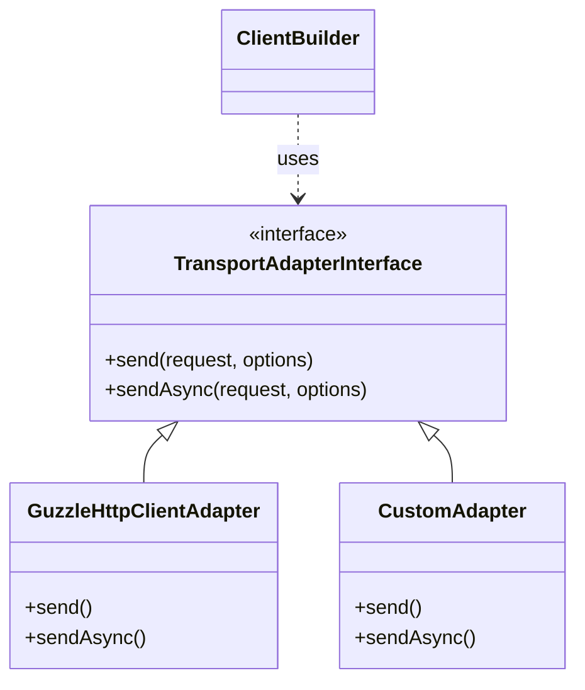
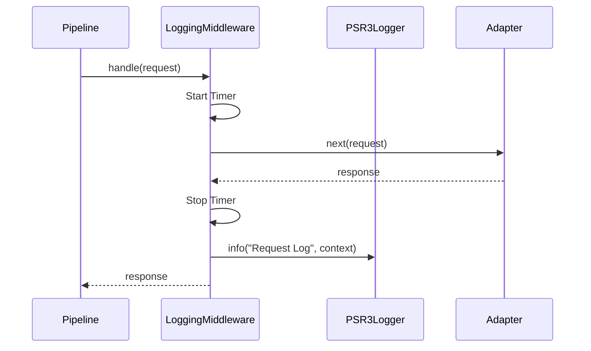

# Extending JOOClient

This guide explains how to extend JOOClient with custom adapters, middleware, and loggers.

## 1. Custom Transport Adapters

The **Transport Adapter** is the lowest layer responsible for actually sending HTTP requests. By default, JOOClient uses `GuzzleHttp\Client`. You can replace this to use a different HTTP client (e.g., Symfony HttpClient) or for advanced mocking.

### Interface Definition

Your adapter must implement `JOOservices\Client\Contracts\TransportAdapterInterface`:

```php
interface TransportAdapterInterface
{
    public function send(RequestInterface $request, array $options = []): ResponseInterface;
    
    public function sendAsync(RequestInterface $request, array $options = []): PromiseInterface;
}
```

### Example: Symfony HttpClient Adapter

```php
use JOOservices\Client\Contracts\TransportAdapterInterface;
use Psr\Http\Message\RequestInterface;
use Psr\Http\Message\ResponseInterface;
use GuzzleHttp\Promise\PromiseInterface;
use Symfony\Component\HttpClient\HttpClient;

class SymfonyHttpAdapter implements TransportAdapterInterface
{
    private $client;

    public function __construct() {
        $this->client = HttpClient::create();
    }

    public function send(RequestInterface $request, array $options = []): ResponseInterface
    {
        // Convert PSR-7 request to Symfony request and send...
        // Return PSR-7 response
    }

    public function sendAsync(RequestInterface $request, array $options = []): PromiseInterface
    {
        // Implement async logic...
    }
}
```

### Usage

Inject your custom adapter into the builder:

```php
$builder = ClientBuilder::create()
    ->withAdapter(new SymfonyHttpAdapter())
    ->build();
```

### Class Diagram



---

## 2. Custom Middleware

Middleware allows you to intercept requests before they are sent and responses after they are received.

### Interface Definition

```php
interface MiddlewareInterface
{
    public function __invoke(RequestInterface $request, array $options, Closure $next): ResponseInterface;
}
```

### Example: Header Injection Middleware

```php
use JOOservices\Client\Contracts\MiddlewareInterface;
use Psr\Http\Message\RequestInterface;
use Psr\Http\Message\ResponseInterface;
use Closure;

class ApiKeyMiddleware implements MiddlewareInterface
{
    public function __construct(private string $apiKey) {}

    public function __invoke(RequestInterface $request, array $options, Closure $next): ResponseInterface
    {
        // modify request
        $request = $request->withHeader('X-API-Key', $this->apiKey);

        // Call next handler
        /** @var ResponseInterface $response */
        $response = $next($request, $options);

        // (Optional) inspect response
        return $response;
    }
}
```

### Usage

```php
$builder = ClientBuilder::create()
    ->withMiddleware(new ApiKeyMiddleware('secret_123'), 'api_key_injector');
```

---

## 3. Custom Loggers

JOOClient uses standard **PSR-3** loggers. You can use any PSR-3 compatible logger (Monolog, Log4php, etc.).

### Usage

```php
use Monolog\Logger;
use Monolog\Handler\StreamHandler;

// Create any PSR-3 logger
$logger = new Logger('my_app');
$logger->pushHandler(new StreamHandler('path/to/app.log', Logger::DEBUG));

// Inject into builder
$builder = ClientBuilder::create()
    ->withLogger($logger, logBodies: true);
```

### Architecture Note

The `LoggingMiddleware` captures requests/responses and delegates writing to the injected `LoggerInterface`.


