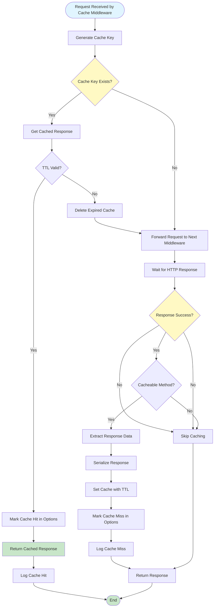

# Caching Flow

How cache middleware handles cache hits and misses.

## Overview

Cache middleware intercepts requests to check for cached responses. If a cache hit occurs, the HTTP request is skipped. If a cache miss occurs, the request proceeds and the response is cached.

## Flow Diagram



## Step-by-Step Process

### Step 1: Generate Cache Key

**What happens:** Cache key is generated from request URI and method.

**Code location:** `src/Cache/Middleware/CacheMiddleware.php`

**Key generation:**
```php
$key = 'jooclient:cache:' . md5($request->getMethod() . ':' . (string)$request->getUri());
```

**Key includes:**
- HTTP method (GET, POST, etc.)
- Full URI (including query string)

### Step 2: Check Cache

**What happens:** Cache adapter checks if key exists.

**Code location:** `src/Cache/Middleware/CacheMiddleware.php:63-108`

**Cache adapters:**
- Redis: `src/Cache/Adapters/RedisCacheAdapter.php`
- Filesystem: `src/Cache/Adapters/FilesystemCacheAdapter.php`

### Step 3: Cache Hit Path

**What happens:** If cache exists and TTL is valid, return cached response.

**Key logic:**
1. Retrieve cached response
2. Validate TTL (if expired, delete and continue)
3. Mark cache hit in options (for logging)
4. Return cached response immediately
5. Skip HTTP request

### Step 4: Cache Miss Path

**What happens:** If cache doesn't exist, forward request and cache response.

**Key logic:**
1. Forward request to next middleware
2. Wait for HTTP response
3. Check if response is cacheable
4. If cacheable: serialize and cache
5. Return response

### Step 5: Cacheability Check

**What happens:** Determines if response should be cached.

**Cacheable conditions:**
- HTTP method is GET (by default)
- Response status is 2xx
- No `Cache-Control: no-cache` header
- Response body is not too large

**Non-cacheable:**
- POST, PUT, DELETE, PATCH requests
- Error responses (4xx, 5xx)
- Responses with `Cache-Control: no-cache`

### Step 6: Cache Storage

**What happens:** Response is serialized and stored in cache.

**Storage format:**
```php
[
    'status' => 200,
    'headers' => [...],
    'body' => '...',
    'cached_at' => time(),
]
```

**TTL:** Configurable via `JOOCLIENT_CACHE_TTL` (default: 3600 seconds)

## Decision Points

### Decision 1: Cache Key Generation

**When:** Request received

**Key includes:**
- Method + URI (ensures different methods don't collide)
- Query string (ensures different queries are cached separately)

### Decision 2: TTL Validation

**When:** Cache hit occurs

**If expired:** Delete cache, proceed with HTTP request
**If valid:** Return cached response immediately

### Decision 3: Cacheability

**When:** Response received

**If cacheable:** Store in cache
**If not cacheable:** Skip caching, return response

## Code References

- **Cache Middleware:** `src/Cache/Middleware/CacheMiddleware.php`
- **Redis Adapter:** `src/Cache/Adapters/RedisCacheAdapter.php`
- **Filesystem Adapter:** `src/Cache/Adapters/FilesystemCacheAdapter.php`
- **Cache Factory:** `src/Cache/CacheFactory.php`

## Related Flows

- [Request Lifecycle](request-lifecycle.md) - Where caching fits in the request flow
- [Factory Creation](factory-creation.md) - How caching is enabled

---

**Copyright (c) 2025 Viet Vu <jooservices@gmail.com>**  
**Company: JOOservices Ltd**  
Licensed under the MIT License.
