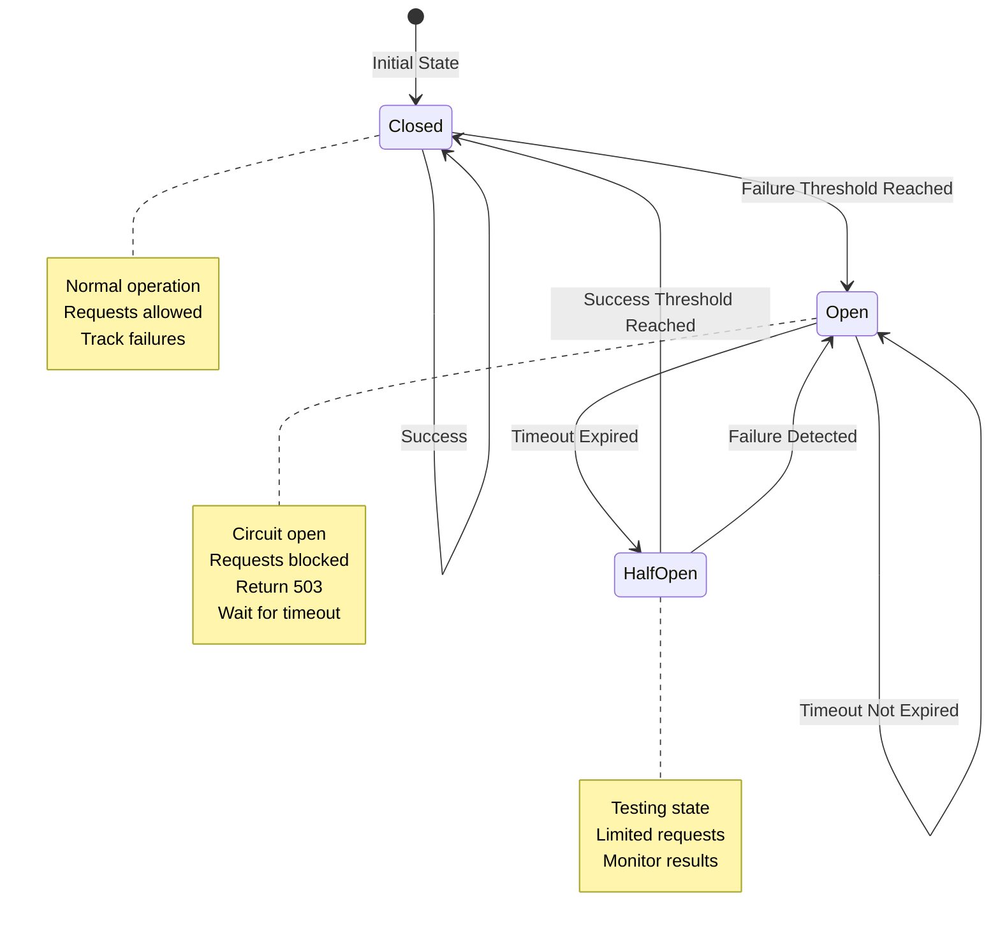
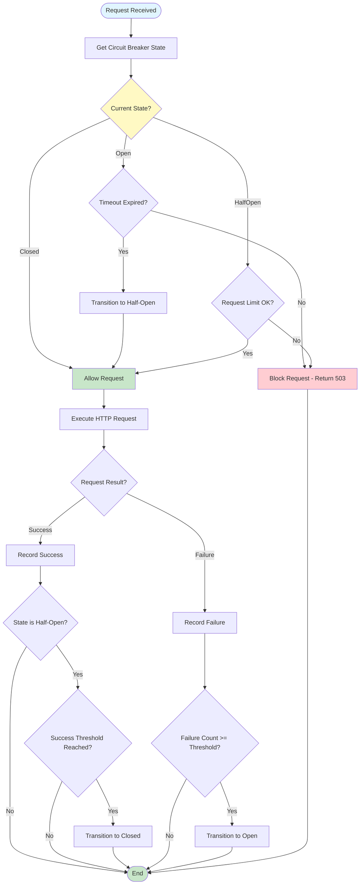

# Circuit Breaker Flow

Circuit breaker state transitions and decision logic.

## Overview

Circuit breaker protects against cascading failures by opening the circuit when failure threshold is reached, preventing requests from reaching a failing service.

## State Machine



## Request Handling Flow



## States

### Closed (Normal Operation)

**Behavior:**
- All requests are allowed
- Failures are tracked
- Successes reset failure count

**Transition to Open:**
- Failure count >= threshold
- Timeout period starts

### Open (Circuit Open)

**Behavior:**
- All requests are blocked
- Returns 503 immediately
- No requests reach the service

**Transition to Half-Open:**
- Timeout period expires
- Allows limited requests to test service

### Half-Open (Testing)

**Behavior:**
- Limited requests allowed (default: 3)
- Monitors success/failure rate
- Tests if service recovered

**Transition to Closed:**
- Success threshold reached
- Service appears healthy

**Transition to Open:**
- Failure detected
- Service still failing

## Configuration

```php
$factory = (new Factory())
    ->enableCircuitBreaker([
        'failure_threshold' => 5,      // Open after 5 failures
        'timeout' => 60,               // Stay open for 60 seconds
        'half_open_max' => 3,          // Allow 3 requests in half-open
        'per_domain' => true,          // Separate circuit per domain
    ]);
```

## Code References

- **Circuit Breaker:** `src/CircuitBreaker/CircuitBreaker.php`
- **Middleware:** `src/CircuitBreaker/Middleware/CircuitBreakerMiddleware.php`
- **Factory:** `src/CircuitBreaker/CircuitBreakerFactory.php`

## Related Flows

- [Request Lifecycle](request-lifecycle.md) - Where circuit breaker fits in the request flow
- [Factory Creation](factory-creation.md) - How circuit breaker is enabled

---

**Copyright (c) 2025 Viet Vu <jooservices@gmail.com>**  
**Company: JOOservices Ltd**  
Licensed under the MIT License.
