# Factory Creation Flow

How `Factory::make()` creates a configured Guzzle client instance.

## Overview

The Factory pattern is used to create configured HTTP clients. When you call `Factory::make()`, it:

1. Applies default configuration
2. Builds middleware stack
3. Creates Guzzle client
4. Wraps in Client class

## Flow Diagram

```mermaid
flowchart TD
    Start([Factory::make called]) --> CheckConfig{Config Applied?}
    CheckConfig -->|No| ApplyDefaults[Apply Default Config]
    CheckConfig -->|Yes| BuildStack
    ApplyDefaults --> BuildStack[Build Middleware Stack]
    
    BuildStack --> CheckLogging{Logging Enabled?}
    CheckLogging -->|Yes| CreateLogger[Create Logger via LoggingFactory]
    CheckLogging -->|No| CheckCache
    CreateLogger --> AddLoggingMW[Add Logging Middleware]
    AddLoggingMW --> CheckCache
    
    CheckCache{Caching Enabled?} -->|Yes| CreateCache[Create Cache Adapter]
    CheckCache -->|No| CheckRetries
    CreateCache --> AddCacheMW[Add Cache Middleware]
    AddCacheMW --> CheckRetries
    
    CheckRetries{Retries Enabled?} -->|Yes| AddRetryMW[Add Retry Middleware]
    CheckRetries -->|No| CheckCircuitBreaker
    AddRetryMW --> CheckCircuitBreaker
    
    CheckCircuitBreaker{Circuit Breaker Enabled?} -->|Yes| AddCBMW[Add Circuit Breaker Middleware]
    CheckCircuitBreaker -->|No| CheckRateLimit
    AddCBMW --> CheckRateLimit
    
    CheckRateLimit{Rate Limiting Enabled?} -->|Yes| AddRateLimitMW[Add Rate Limiting Middleware]
    CheckRateLimit -->|No| AddCustomMW
    AddRateLimitMW --> AddCustomMW
    
    AddCustomMW[Add Custom Middlewares] --> AddUserAgent[Add User Agent Middleware]
    AddUserAgent --> AddCorrelationID{Correlation ID Enabled?}
    AddCorrelationID -->|Yes| AddCIDMW[Add Correlation ID Middleware]
    AddCorrelationID -->|No| BuildClient
    AddCIDMW --> BuildClient
    
    BuildClient[Build Guzzle Client] --> WrapClient[Wrap in Client Class]
    WrapClient --> Return([Return Client Instance])
    
    style Start fill:#e1f5ff
    style Return fill:#c8e6c9
    style CheckLogging fill:#fff9c4
    style CheckCache fill:#fff9c4
    style CheckRetries fill:#fff9c4
```

## Step-by-Step Process

### Step 1: Factory Configuration

**What happens:** Factory instance is configured with options, middlewares, and features.

**Code location:** `src/Factory/Factory.php`

**Key methods:**
- `addOptions()` - Add Guzzle options
- `enableLogging()` - Enable logging
- `enableCache()` - Enable caching
- `enableRetries()` - Enable retry logic

### Step 2: Apply Defaults (Optional)

**What happens:** If `withDefaults()` is called, default configuration is applied.

**Code location:** `src/Factory/Builders/ConfigApplier.php`

**Key decisions:**
- Load from config file
- Apply preset (development/production/testing)
- Merge with existing options

### Step 3: Build Middleware Stack

**What happens:** MiddlewareStackBuilder creates a HandlerStack with all middlewares.

**Code location:** `src/Factory/Builders/MiddlewareStackBuilder.php`

**Execution order (LIFO - Last In First Out):**
1. Interceptor middleware (if any)
2. Correlation ID middleware (if enabled)
3. Custom middlewares (in order added)
4. User Agent middleware (if enabled)
5. History middleware (if enabled)

### Step 4: Create Logger (If Enabled)

**What happens:** LoggingFactory creates appropriate logger based on config.

**Code location:** `src/Logging/LoggingFactory.php`

**Supported drivers:**
- MySQL - `DbLogger`
- MongoDB - `MongoDbLogger`
- Monolog - `MonologLoggingAdapter`
- Multi - `LoggingManager` (multiple drivers)

### Step 5: Add Middlewares

**What happens:** Each enabled feature adds its middleware to the stack.

**Middleware registration:**
- Logging → `DbLoggingMiddlewareFactory::create()`
- Cache → `CacheMiddleware`
- Retry → Guzzle's `RetryMiddleware`
- Circuit Breaker → `CircuitBreakerMiddleware`
- Rate Limiting → `RateLimitingMiddleware`

### Step 6: Build Guzzle Client

**What happens:** ClientBuilder creates Guzzle Client with HandlerStack and options.

**Code location:** `src/Factory/Builders/ClientBuilder.php`

**Key components:**
- HandlerStack with all middlewares
- Options (timeout, base_uri, headers, etc.)
- Mock handler (if testing)

### Step 7: Wrap in Client Class

**What happens:** Guzzle client is wrapped in JOOClient's Client class.

**Code location:** `src/Factory/Client.php`

**Benefits:**
- Access to logger for flushing
- Convenience methods (get, post, etc.)
- Response wrapping
- Request chaining support

## Decision Points

### Decision 1: Logging Driver Selection

**When:** `enableLogging()` is called

**If MySQL:** Creates `DbLogger` with MySQL connection
**If MongoDB:** Creates `MongoDbLogger` with MongoDB connection
**If Monolog:** Creates `MonologLoggingAdapter` with file handler
**If Multi:** Creates `LoggingManager` with multiple drivers

### Decision 2: Cache Driver Selection

**When:** `enableCache()` is called

**If Redis:** Creates `RedisCacheAdapter`
**If Filesystem:** Creates `FilesystemCacheAdapter`
**If None:** Returns null, caching disabled

### Decision 3: Middleware Order

**When:** Building middleware stack

**Order matters because:**
- Middleware executes in reverse order (LIFO)
- Cache should be early (before HTTP)
- Logging should be late (after HTTP)
- Retry should wrap HTTP handler

## Code References

- **Factory:** `src/Factory/Factory.php`
- **ClientBuilder:** `src/Factory/Builders/ClientBuilder.php`
- **MiddlewareStackBuilder:** `src/Factory/Builders/MiddlewareStackBuilder.php`
- **ConfigApplier:** `src/Factory/Builders/ConfigApplier.php`
- **LoggingFactory:** `src/Logging/LoggingFactory.php`
- **CacheFactory:** `src/Cache/CacheFactory.php`

## Related Flows

- [Request Lifecycle](request-lifecycle.md) - How requests flow through the client
- [Middleware Stack](middleware-stack.md) - Middleware composition details

---

**Copyright (c) 2025 Viet Vu <jooservices@gmail.com>**  
**Company: JOOservices Ltd**  
Licensed under the MIT License.
