# Logging Flow

How logging middleware captures and stores request/response data.

## Overview

When logging is enabled, every HTTP request and response is captured, enriched with metadata, sanitized for sensitive data, and persisted to the configured storage (MySQL, MongoDB, or Monolog).

## Flow Diagram

```mermaid
flowchart TD
    Start([Request Received by Logging Middleware]) --> CaptureStart[Capture Start Time]
    CaptureStart --> ExtractRequest[Extract Request Data]
    
    ExtractRequest --> Method[Extract Method, URI, Headers]
    Method --> BodyHandler{Body Handler}
    BodyHandler --> BufferBody[Buffer/Replace Non-Seekable Body]
    BufferBody --> SafeRead[Safe Read Body Content]
    
    SafeRead --> ForwardRequest[Forward Request to Next Middleware]
    ForwardRequest --> WaitResponse[Wait for Response]
    
    WaitResponse --> ResponseReceived{Response Received?}
    ResponseReceived -->|Success| ExtractResponse[Extract Response Data]
    ResponseReceived -->|Error| ExtractError[Extract Error Data]
    
    ExtractResponse --> Status[Extract Status Code]
    Status --> ResponseBody[Safe Read Response Body]
    ResponseBody --> CalculateDuration[Calculate Duration]
    
    ExtractError --> ErrorStatus[Extract Error Status]
    ErrorStatus --> ErrorBody[Extract Error Body/Message]
    ErrorBody --> CalculateDuration
    
    CalculateDuration --> EnrichMetrics[Enrich with Performance Metrics]
    EnrichMetrics --> EnrichMetadata[Enrich with Structured Metadata]
    EnrichMetadata --> Sanitize{Sensitive Data?}
    
    Sanitize -->|Yes| RedactData[Redact Sensitive Fields]
    Sanitize -->|No| BuildRow
    RedactData --> BuildRow
    
    BuildRow[Build Log Row] --> CheckBatch{Batch Mode?}
    CheckBatch -->|Yes| AddToBuffer[Add to Buffer]
    CheckBatch -->|No| PersistImmediate[Persist Immediately]
    
    AddToBuffer --> CheckBufferSize{Buffer Full?}
    CheckBufferSize -->|Yes| FlushBatch[Flush Batch to DB]
    CheckBufferSize -->|No| ReturnResponse
    FlushBatch --> ReturnResponse
    
    PersistImmediate --> PersistDB[Persist to Database]
    PersistDB --> CheckSuccess{Persist Success?}
    CheckSuccess -->|No| Fallback[Use Fallback Logger]
    CheckSuccess -->|Yes| ReturnResponse
    Fallback --> ReturnResponse
    
    ReturnResponse[Return Response to Caller] --> End([End])
    
    style Start fill:#e1f5ff
    style End fill:#c8e6c9
    style Sanitize fill:#fff9c4
    style CheckBatch fill:#fff9c4
    style CheckSuccess fill:#fff9c4
```



## Step-by-Step Process

### Phase 1: Request Capture

#### Step 1: Capture Start Time

**What happens:** Microsecond timestamp is captured for duration calculation.

**Code location:** `src/Logging/Middlewares/DbLoggingMiddlewareFactory.php:25`

**Key logic:**
```php
$startTime = microtime(true);
```

#### Step 2: Extract Request Data

**What happens:** Request metadata is extracted.

**Code location:** `src/Logging/Extractors/RequestResponseExtractor.php`

**Extracted data:**
- HTTP method
- URI path and full endpoint
- Headers
- Request body

#### Step 3: Handle Request Body

**What happens:** Non-seekable request bodies are buffered for logging.

**Code location:** `src/Logging/Handlers/RequestBodyHandler.php`

**Key logic:**
- Check if body is seekable
- If not: buffer and replace with seekable stream
- If yes: read directly

**Why:** Request bodies can only be read once. We need to read for logging without consuming the original stream.

### Phase 2: Response Capture

#### Step 4: Wait for Response

**What happens:** Request is forwarded to next middleware, response is awaited.

**Code location:** `src/Logging/Middlewares/DbLoggingMiddlewareFactory.php:34`

**Key logic:**
```php
return $handler($request, $options)->then(
    // Success handler
    // Error handler
);
```

#### Step 5: Extract Response Data

**What happens:** Response metadata is extracted.

**Code location:** `src/Logging/Extractors/RequestResponseExtractor.php`

**Extracted data:**
- Status code
- Response headers
- Response body

**For errors:**
- Exception message
- Exception class
- Stack trace (if available)

#### Step 6: Calculate Duration

**What happens:** Request duration is calculated.

**Code location:** `src/Logging/Middlewares/DbLoggingMiddlewareFactory.php:57`

**Key logic:**
```php
$duration = microtime(true) - $startTime;
```

### Phase 3: Data Enrichment

#### Step 7: Enrich with Performance Metrics

**What happens:** Performance metrics are added to context.

**Code location:** `src/Logging/Enrichers/PerformanceMetricsEnricher.php`

**Metrics added:**
- `duration_ms` - Duration in milliseconds
- `duration_seconds` - Duration in seconds
- `retry_count` - Number of retries
- `cache_hit` - Whether cache was hit

#### Step 8: Enrich with Structured Metadata

**What happens:** Structured metadata is added to context.

**Code location:** `src/Logging/Enrichers/StructuredMetadataEnricher.php`

**Metadata added:**
- `response_status` - HTTP status code
- `level` - Log level (info, error, etc.)
- `context` - Additional context data

### Phase 4: Sanitization

#### Step 9: Sanitize Sensitive Data

**What happens:** Sensitive data patterns are redacted.

**Code location:** `src/Logging/Extractors/RequestResponseExtractor.php`

**Default patterns:**
- Passwords
- API keys
- Tokens
- Credit card numbers
- CVV codes

**Customization:**
```php
// config/jooclient.php
'logging' => [
    'sanitization' => [
        'enabled' => true,
        'keywords' => ['password', 'secret', 'api_key'],
    ],
],
```

### Phase 5: Persistence

#### Step 10: Build Log Row

**What happens:** Log entry is built with all extracted data.

**Code location:** `src/Logging/Middlewares/DbLoggingMiddlewareFactory.php:61-68`

**Row structure:**
```php
[
    'method' => 'GET',
    'path' => '/api/users',
    'request_endpoint' => 'https://api.example.com/api/users',
    'request_headers' => [...],
    'request_body' => '...',
    'response_status' => 200,
    'response_body' => '...',
    'context' => [...],
    'created_at' => '2025-01-01 12:00:00',
    'updated_at' => '2025-01-01 12:00:00',
]
```

#### Step 11: Check Batch Mode

**What happens:** Determines if batch mode is enabled.

**Code location:** `src/Logging/DbLogger.php`

**If batch mode:**
- Add to in-memory buffer
- Flush when buffer is full (default: 500 entries)
- Flush on `flushLogger()` call

**If immediate mode:**
- Persist directly to database
- No buffering

#### Step 12: Persist to Database

**What happens:** Log entry is written to storage.

**Code location:**
- MySQL: `src/Logging/DbLogger.php`
- MongoDB: `src/Logging/MongoDbLogger.php`
- Monolog: `src/Logging/Drivers/MonologLoggingAdapter.php`

**MySQL:**
- Uses Laravel's DB facade
- Batch inserts (up to 500 per transaction)
- Schema caching for performance

**MongoDB:**
- Uses MongoDB PHP library
- Batch inserts (up to 500 per operation)
- Automatic collection creation

**Monolog:**
- Uses Monolog handlers
- File rotation support
- JSON or line format

#### Step 13: Error Handling

**What happens:** If persistence fails, fallback logger is used.

**Code location:** `src/Logging/DbLogger.php:267-310`

**Fallback options:**
- `error_log` - PHP error log (default)
- `throw` - Throw exception
- `silent` - Suppress errors

**Failure logs:**
- MySQL: `/tmp/jooclient_db_logger_failures.log`
- MongoDB: `/tmp/jooclient_mongodb_logger_failures.log`

## Decision Points

### Decision 1: Batch vs Immediate Mode

**When:** Logging is configured

**If batch mode:**
- Better performance (10x faster)
- Requires `flushLogger()` call
- Risk of data loss on crash

**If immediate mode:**
- Slower but safer
- No flush needed
- Data always persisted

### Decision 2: Body Size Limits

**When:** Reading request/response bodies

**Default limit:** 65KB per body

**Why:** Prevents memory issues with large bodies

**Customization:** Extend `RequestResponseExtractor`

### Decision 3: Fallback Strategy

**When:** Database write fails

**If error_log:** Write to PHP error log
**If throw:** Fail fast, throw exception
**If silent:** Suppress error (not recommended)

## Code References

- **Logging Middleware:** `src/Logging/Middlewares/DbLoggingMiddlewareFactory.php`
- **Extractor:** `src/Logging/Extractors/RequestResponseExtractor.php`
- **Body Handler:** `src/Logging/Handlers/RequestBodyHandler.php`
- **DbLogger:** `src/Logging/DbLogger.php`
- **MongoDbLogger:** `src/Logging/MongoDbLogger.php`
- **Enrichers:** `src/Logging/Enrichers/`

## Related Flows

- [Request Lifecycle](request-lifecycle.md) - Where logging fits in the request flow
- [Factory Creation](factory-creation.md) - How logging is enabled

---

**Copyright (c) 2025 Viet Vu <jooservices@gmail.com>**  
**Company: JOOservices Ltd**  
Licensed under the MIT License.
