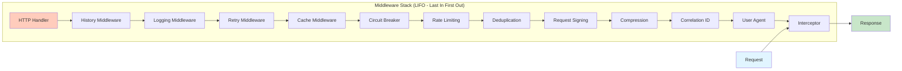

# Middleware Stack Flow

How middleware is composed and executed in order.

## Overview

JOOClient uses Guzzle's HandlerStack to compose middleware. Middleware executes in LIFO (Last In First Out) order - the last middleware added executes first on the request, and last on the response.

## Flow Diagram



## Execution Order

### Request Phase (Top to Bottom)

1. **Interceptor Middleware** - First to see request
2. **Correlation ID Middleware** - Adds correlation ID
3. **User Agent Middleware** - Adds random user agent
4. **Compression Middleware** - Compresses request body
5. **Request Signing Middleware** - Signs request
6. **Deduplication Middleware** - Checks for duplicates
7. **Rate Limiting Middleware** - Checks rate limits
8. **Circuit Breaker Middleware** - Checks circuit state
9. **Cache Middleware** - Checks cache
10. **Retry Middleware** - Handles retries
11. **Logging Middleware** - Logs request/response
12. **History Middleware** - Records history
13. **HTTP Handler** - Sends actual request

### Response Phase (Bottom to Top)

1. **HTTP Handler** - Receives response
2. **History Middleware** - Records response
3. **Logging Middleware** - Logs response
4. **Retry Middleware** - Handles failures
5. **Cache Middleware** - Stores in cache
6. **Circuit Breaker Middleware** - Updates state
7. **Rate Limiting Middleware** - Updates tokens
8. **Deduplication Middleware** - Stores fingerprint
9. **Request Signing Middleware** - (No response action)
10. **Compression Middleware** - Decompresses response
11. **User Agent Middleware** - (No response action)
12. **Correlation ID Middleware** - (No response action)
13. **Interceptor Middleware** - Last to modify response

## Middleware Registration

### Code Location

`src/Factory/Builders/MiddlewareStackBuilder.php`

### Registration Order

```php
// 1. Interceptor (if any)
if ($interceptorMiddleware !== null) {
    $handler->push($interceptorMiddleware, 'interceptor');
}

// 2. Correlation ID (if enabled)
if ($correlationIdEnabled && $correlationIdMiddleware !== null) {
    $handler->push($correlationIdMiddleware, 'correlation_id');
}

// 3. Custom middlewares (in order added)
foreach ($middlewares as [$mw, $name]) {
    $handler->push($mw, $name);
}

// 4. User Agent (unshift = adds to beginning)
if ($randomUserAgentEnabled) {
    $handler->unshift(new DesktopUserAgentMiddleware($userAgentSession), 'desktop_user_agent');
}

// 5. History (if enabled)
if ($hasMockResponses || $requestHistoryEnabled) {
    $handler->push(Middleware::history($historyContainer), 'history');
}
```

## Why LIFO?

LIFO (Last In First Out) ensures:

1. **Request Phase:** Last middleware added wraps everything below it
2. **Response Phase:** First middleware added sees the final response first
3. **Error Handling:** Outer middleware can catch errors from inner middleware

### Example

If you add middleware in this order:
1. Logging
2. Cache
3. Retry

Execution order:
- **Request:** Retry → Cache → Logging → HTTP
- **Response:** HTTP → Logging → Cache → Retry

This means:
- Retry wraps everything (can retry on any failure)
- Cache is inside retry (cache hits don't trigger retries)
- Logging is inside cache (logs both cache hits and misses)

## Middleware Dependencies

Some middleware depends on others:

### Cache Before Retry

**Why:** Cache hits shouldn't trigger retries

**Order:** Cache → Retry

### Logging After HTTP

**Why:** Logging needs actual response data

**Order:** HTTP → Logging

### Circuit Breaker Before HTTP

**Why:** Should block requests before sending

**Order:** Circuit Breaker → HTTP

## Custom Middleware

### Adding Custom Middleware

```php
$factory = (new Factory())
    ->addMiddleware(function (callable $handler) {
        return function ($request, $options) use ($handler) {
            // Before HTTP
            $request = $request->withHeader('X-Custom', 'value');
            
            return $handler($request, $options)->then(
                function ($response) {
                    // After HTTP
                    return $response;
                }
            );
        };
    }, 'custom');
```

### Middleware Structure

```php
function (callable $handler): callable {
    return function (RequestInterface $request, array $options) use ($handler) {
        // Request phase - modify request before HTTP
        $request = $request->withHeader('X-Header', 'value');
        
        // Call next middleware (or HTTP handler)
        return $handler($request, $options)->then(
            function ($response) {
                // Response phase - modify response after HTTP
                return $response;
            },
            function ($reason) {
                // Error phase - handle errors
                throw $reason;
            }
        );
    };
}
```

## Code References

- **MiddlewareStackBuilder:** `src/Factory/Builders/MiddlewareStackBuilder.php`
- **HandlerStack:** Guzzle's HandlerStack class
- **Middleware Registration:** `src/Factory/Factory.php:573-579`

## Related Flows

- [Factory Creation](factory-creation.md) - How middleware is registered
- [Request Lifecycle](request-lifecycle.md) - How requests flow through middleware

---

**Copyright (c) 2025 Viet Vu <jooservices@gmail.com>**  
**Company: JOOservices Ltd**  
Licensed under the MIT License.
