# Request Lifecycle Flow

Complete flow from `Client::request()` to response, including all middleware execution.

## Overview

When you call `Client::request()`, the request flows through multiple middleware layers before reaching the HTTP handler, then flows back through the same layers as a response.

## Flow Diagram

```mermaid
flowchart TD
    Start([Client::request called]) --> ApplyTemplate{Template Specified?}
    ApplyTemplate -->|Yes| MergeTemplate[Merge Template Options]
    ApplyTemplate -->|No| MiddlewareStack
    MergeTemplate --> MiddlewareStack
    
    MiddlewareStack[Enter Middleware Stack] --> UserAgent[Desktop User Agent Middleware]
    UserAgent --> CorrelationID{Correlation ID Enabled?}
    CorrelationID -->|Yes| AddCID[Add Correlation ID Header]
    CorrelationID -->|No| Interceptor
    AddCID --> Interceptor
    
    Interceptor{Interceptor Middleware?} -->|Yes| RunInterceptor[Run Request Interceptor]
    Interceptor -->|No| CircuitBreaker
    RunInterceptor --> CircuitBreaker
    
    CircuitBreaker{Circuit Breaker Enabled?} -->|Open| Return503[Return 503 Response]
    CircuitBreaker -->|Closed| RateLimit
    Return503 --> End
    
    RateLimit{Rate Limiting Enabled?} -->|Exceeded| Return429[Return 429 Response]
    RateLimit -->|Allowed| Deduplication
    Return429 --> End
    
    Deduplication{Deduplication Enabled?} -->|Duplicate| ReturnCached[Return Cached Response]
    Deduplication -->|New| Cache
    ReturnCached --> LogResponse
    Cache -->|Miss| RequestSigning
    Cache -->|Hit| ReturnCache[Return Cached Response]
    ReturnCache --> LogResponse
    
    RequestSigning{Request Signing Enabled?} -->|Yes| SignRequest[Sign Request]
    RequestSigning -->|No| Compression
    SignRequest --> Compression
    
    Compression{Compression Enabled?} -->|Yes| CompressRequest[Compress Request Body]
    Compression -->|No| Retry
    CompressRequest --> Retry
    
    Retry{Retries Enabled?} -->|Yes| RetryMW[Retry Middleware]
    Retry -->|No| HTTP
    RetryMW --> HTTP
    
    HTTP[HTTP Handler - Send Request] --> ReceiveResponse[Receive HTTP Response]
    ReceiveResponse --> Decompress{Compression Enabled?}
    Decompress -->|Yes| DecompressResponse[Decompress Response]
    Decompress -->|No| ValidateResponse
    DecompressResponse --> ValidateResponse
    
    ValidateResponse{Response Validation Enabled?} -->|Invalid| ReturnError[Return Validation Error]
    ValidateResponse -->|Valid| LogResponse
    ReturnError --> End
    
    LogResponse{Logging Enabled?} -->|Yes| Log[Log Request/Response]
    LogResponse -->|No| ResponseInterceptor
    Log --> ResponseInterceptor
    
    ResponseInterceptor{Response Interceptor?} -->|Yes| RunResponseInterceptor[Run Response Interceptor]
    ResponseInterceptor -->|No| WrapResponse
    RunResponseInterceptor --> WrapResponse
    
    WrapResponse[Wrap in ResponseWrapper] --> End([Return ResponseWrapper])
    
    style Start fill:#e1f5ff
    style End fill:#c8e6c9
    style HTTP fill:#ffccbc
    style Return503 fill:#ffcdd2
    style Return429 fill:#ffcdd2
    style ReturnCache fill:#c8e6c9
```

## Step-by-Step Process

### Phase 1: Request Preparation

#### Step 1: Template Application

**What happens:** If `template` option is specified, template options are merged.

**Code location:** `src/Factory/Client.php:116-123`

**Key logic:**
- Lookup template from `TemplateRegistry`
- Merge template options with request options
- Remove `template` key from options

#### Step 2: Enter Middleware Stack

**What happens:** Request enters the middleware stack (LIFO execution).

**Code location:** Guzzle's HandlerStack

**Execution order (reverse of registration):**
1. History middleware (if enabled)
2. User Agent middleware
3. Custom middlewares (reverse order)
4. Correlation ID middleware
5. Interceptor middleware

### Phase 2: Request Processing (Before HTTP)

#### Step 3: User Agent Middleware

**What happens:** Random desktop user agent is added to request headers.

**Code location:** `src/Middlewares/DesktopUserAgentMiddleware.php`

**Key logic:**
- Generate or reuse user agent from session
- Add `User-Agent` header
- Preserve existing header if set

#### Step 4: Correlation ID Middleware

**What happens:** Correlation ID is generated and added to headers.

**Code location:** `src/Middlewares/CorrelationIdMiddleware.php`

**Key logic:**
- Generate UUID if not present
- Add to `X-Correlation-ID` header
- Propagate through request chain

#### Step 5: Interceptor Middleware

**What happens:** Request interceptors are executed.

**Code location:** `src/Middlewares/InterceptorMiddleware.php`

**Key logic:**
- Run `onRequest` callbacks
- Allow request/options modification
- Continue to next middleware

#### Step 6: Circuit Breaker

**What happens:** Circuit breaker checks if requests are allowed.

**Code location:** `src/CircuitBreaker/Middleware/CircuitBreakerMiddleware.php`

**Key logic:**
- Check circuit state (closed/open/half-open)
- If open: return 503 immediately
- If closed/half-open: allow request

#### Step 7: Rate Limiting

**What happens:** Rate limiter checks if request rate is within limits.

**Code location:** `src/RateLimit/Middleware/RateLimitingMiddleware.php`

**Key logic:**
- Check token bucket or sliding window
- If exceeded: return 429 immediately
- If allowed: decrement tokens and continue

#### Step 8: Deduplication

**What happens:** Check if identical request was made recently.

**Code location:** `src/Middlewares/DeduplicationMiddleware.php`

**Key logic:**
- Generate request fingerprint
- Check cache for duplicate
- If duplicate: return cached response
- If new: continue

#### Step 9: Cache Lookup

**What happens:** Check cache for cached response.

**Code location:** `src/Cache/Middleware/CacheMiddleware.php`

**Key logic:**
- Generate cache key from request
- Check cache adapter
- If hit: return cached response
- If miss: continue and mark in options

#### Step 10: Request Signing

**What happens:** Request is signed (HMAC, OAuth1, etc.).

**Code location:** `src/Signing/Middleware/RequestSigningMiddleware.php`

**Key logic:**
- Generate signature based on type
- Add signature to headers
- Continue to next middleware

#### Step 11: Compression

**What happens:** Request body is compressed if supported.

**Code location:** `src/Middlewares/CompressionMiddleware.php`

**Key logic:**
- Check if compression is supported
- Compress request body
- Add `Content-Encoding` header

#### Step 12: Retry Middleware

**What happens:** Retry middleware wraps HTTP handler.

**Code location:** Guzzle's `RetryMiddleware`

**Key logic:**
- Attempt request
- On failure: check retry conditions
- If retryable: wait and retry
- If not: throw exception

### Phase 3: HTTP Execution

#### Step 13: HTTP Handler

**What happens:** Actual HTTP request is sent via cURL.

**Code location:** Guzzle's HTTP handler

**Key logic:**
- Build HTTP request
- Send via cURL
- Receive HTTP response
- Return response

### Phase 4: Response Processing (After HTTP)

#### Step 14: Response Decompression

**What happens:** Response body is decompressed if compressed.

**Code location:** `src/Middlewares/CompressionMiddleware.php`

**Key logic:**
- Check `Content-Encoding` header
- Decompress response body
- Continue to next middleware

#### Step 15: Response Validation

**What happens:** Response is validated against schema if enabled.

**Code location:** `src/Validation/ResponseValidator.php`

**Key logic:**
- Load validation schema
- Validate response structure
- If invalid: return error
- If valid: continue

#### Step 16: Logging

**What happens:** Request and response are logged.

**Code location:** `src/Logging/Middlewares/DbLoggingMiddlewareFactory.php`

**Key logic:**
- Extract request data
- Extract response data
- Enrich with metadata
- Persist to database

#### Step 17: Response Interceptor

**What happens:** Response interceptors are executed.

**Code location:** `src/Middlewares/InterceptorMiddleware.php`

**Key logic:**
- Run `onResponse` callbacks
- Allow response modification
- Continue to wrapper

#### Step 18: Response Wrapping

**What happens:** Response is wrapped in `ResponseWrapper`.

**Code location:** `src/Factory/Client.php:144`

**Key logic:**
- Create `ResponseWrapper` instance
- Attach request for debugging
- Return wrapped response

## Middleware Execution Order

**Request Phase (Before HTTP):**
1. History (records request)
2. User Agent (adds header)
3. Correlation ID (adds header)
4. Interceptor (onRequest)
5. Circuit Breaker (checks state)
6. Rate Limiting (checks rate)
7. Deduplication (checks duplicates)
8. Cache (checks cache)
9. Request Signing (signs request)
10. Compression (compresses body)
11. Retry (wraps HTTP)

**Response Phase (After HTTP):**
1. Retry (handles failures)
2. Compression (decompresses)
3. Response Validation (validates)
4. Logging (logs data)
5. Response Interceptor (onResponse)
6. History (records response)

## Error Handling

### Circuit Breaker Open

**When:** Circuit is in open state

**Action:** Return 503 response immediately

**Code:** `src/CircuitBreaker/Middleware/CircuitBreakerMiddleware.php:63-85`

### Rate Limit Exceeded

**When:** Request rate exceeds limit

**Action:** Return 429 response immediately

**Code:** `src/RateLimit/Middleware/RateLimitingMiddleware.php`

### Cache Hit

**When:** Cached response found

**Action:** Return cached response, skip HTTP

**Code:** `src/Cache/Middleware/CacheMiddleware.php:63-108`

### Validation Error

**When:** Response doesn't match schema

**Action:** Return validation error

**Code:** `src/Validation/ResponseValidator.php`

## Code References

- **Client:** `src/Factory/Client.php`
- **Middleware Stack:** `src/Factory/Builders/MiddlewareStackBuilder.php`
- **Circuit Breaker:** `src/CircuitBreaker/Middleware/CircuitBreakerMiddleware.php`
- **Rate Limiting:** `src/RateLimit/Middleware/RateLimitingMiddleware.php`
- **Cache:** `src/Cache/Middleware/CacheMiddleware.php`
- **Logging:** `src/Logging/Middlewares/DbLoggingMiddlewareFactory.php`

## Related Flows

- [Factory Creation](factory-creation.md) - How the client is created
- [Middleware Stack](middleware-stack.md) - Middleware composition
- [Logging Flow](logging-flow.md) - Detailed logging process
- [Caching Flow](caching-flow.md) - Detailed caching process

---

**Copyright (c) 2025 Viet Vu <jooservices@gmail.com>**  
**Company: JOOservices Ltd**  
Licensed under the MIT License.
