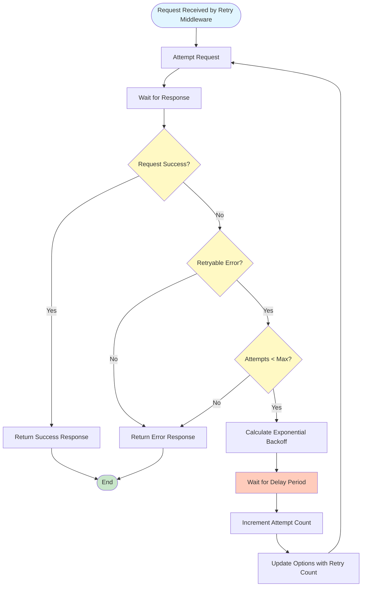

# Retry Flow

How retry middleware handles failed requests with exponential backoff.

## Overview

Retry middleware automatically retries failed requests with exponential backoff. It only retries on specific error conditions (e.g., 5xx errors) and stops after maximum attempts.

## Flow Diagram



## Step-by-Step Process

### Step 1: Attempt Request

**What happens:** Request is forwarded to HTTP handler.

**Code location:** Guzzle's `RetryMiddleware`

**Key logic:**
- Forward request to next middleware
- Wait for response or exception

### Step 2: Check Success

**What happens:** Response status is checked.

**Success conditions:**
- Status code < 400
- No exception thrown

**Failure conditions:**
- Status code >= 400
- Exception thrown (connection error, timeout, etc.)

### Step 3: Check Retryable

**What happens:** Determines if error is retryable.

**Retryable conditions:**
- Status code >= `min_error_code` (default: 500)
- Connection errors
- Timeout errors
- Server exceptions (5xx)

**Non-retryable:**
- Client errors (4xx) - except 429 (rate limit)
- Status code < `min_error_code`

### Step 4: Check Attempts

**What happens:** Checks if maximum retry attempts reached.

**Default:** 3 attempts (1 initial + 2 retries)

**If max reached:** Return error, stop retrying
**If not max:** Proceed to retry

### Step 5: Calculate Delay

**What happens:** Exponential backoff delay is calculated.

**Formula:**
```
delay = base_delay * (2 ^ attempt_number)
```

**Example:**
- Attempt 1 fails → wait 1 second
- Attempt 2 fails → wait 2 seconds
- Attempt 3 fails → wait 4 seconds

**Configuration:**
- `max_attempts`: Maximum retry attempts (default: 3)
- `delay_seconds`: Base delay (default: 1)
- `min_error_code`: Minimum error code to retry (default: 500)

### Step 6: Wait and Retry

**What happens:** System waits for delay period, then retries.

**Key logic:**
1. Wait for calculated delay
2. Increment attempt count
3. Update options with retry count (for logging)
4. Retry request

## Decision Points

### Decision 1: Retryable Error

**When:** Request fails

**If 5xx error:** Retryable (server error)
**If 4xx error:** Not retryable (client error)
**If connection error:** Retryable (transient)
**If timeout:** Retryable (transient)

### Decision 2: Maximum Attempts

**When:** Retryable error occurs

**If attempts < max:** Retry with backoff
**If attempts >= max:** Give up, return error

### Decision 3: Delay Calculation

**When:** Retrying request

**Formula:** Exponential backoff
- Attempt 1: `delay * 1`
- Attempt 2: `delay * 2`
- Attempt 3: `delay * 4`

## Configuration

```php
$factory = (new Factory())
    ->enableRetries(
        maxRetries: 3,        // Maximum retry attempts
        delayInSec: 1,        // Base delay in seconds
        minErrorCode: 500     // Only retry 5xx errors
    );
```

## Code References

- **Retry Middleware:** Guzzle's `RetryMiddleware`
- **Configuration:** `src/Factory/Factory.php:enableRetries()`

## Related Flows

- [Request Lifecycle](request-lifecycle.md) - Where retry fits in the request flow
- [Factory Creation](factory-creation.md) - How retry is enabled

---

**Copyright (c) 2025 Viet Vu <jooservices@gmail.com>**  
**Company: JOOservices Ltd**  
Licensed under the MIT License.
